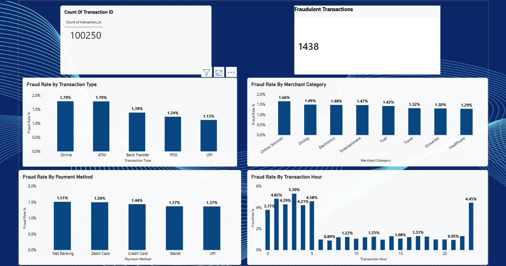
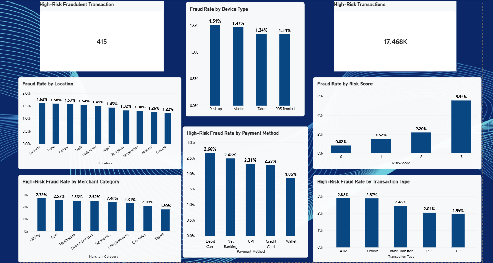
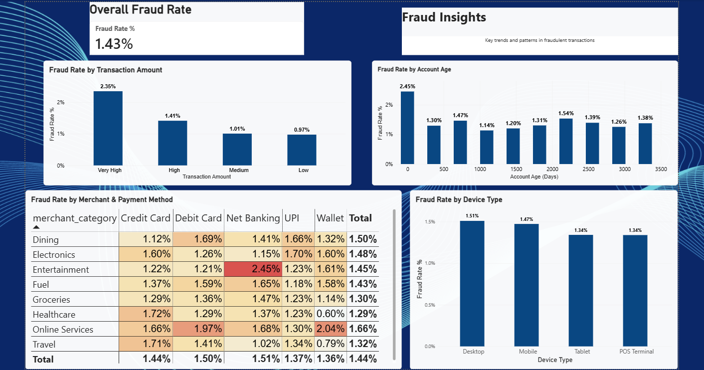

# Banking Fraud Analytics

## Project Overview

Banking Fraud Analytics is a data analytics project focused on analyzing banking transactions to identify fraudulent patterns, risk factors, and transaction trends using Microsoft Power BI.

The project transforms and analyzes transaction data to create an interactive dashboard that helps understand fraud rates across different transaction amounts, account ages, merchant categories, payment methods, and device types.

## Objectives

- Analyze banking transaction data to identify fraudulent patterns.
- Calculate and monitor overall fraud rates.
- Compare fraud rates across transaction risk levels.
- Analyze fraud patterns by merchant category and payment method.
- Examine fraud rates based on account age and device type.
- Present findings through an interactive Power BI dashboard.

## Dataset

- Approximately 100,000+ banking transactions
- Processed and transformed dataset used for analysis
- Multiple transaction, customer, merchant, payment, and risk-related attributes

The processed dataset is available in:

`banking_fraud_processed.csv`

## Tools & Technologies

- Microsoft Power BI
- Power Query
- DAX
- Microsoft Excel
- Data Cleaning
- Data Transformation
- Data Analysis
- Data Visualization

## Dashboard Pages

### 1. Overview

Provides a high-level summary of the banking transaction data and overall fraud metrics.

### 2. Risk Analysis

Analyzes fraud rates across different transaction risk levels and helps identify patterns associated with higher-risk transactions.

### 3. Fraud Insights

Provides deeper analysis of fraud rates across:

- Account age
- Merchant categories
- Payment methods
- Device types

## Key Insights

- Overall fraud rate identified in the dashboard: **1.43%**
- Fraud rates vary across different transaction risk levels.
- Fraud patterns differ across merchant categories and payment methods.
- Account age shows variation in fraud rates across different ranges.
- Device types also show differences in observed fraud rates.
- The dashboard helps identify areas that may require further fraud-risk investigation.

## Dashboard Preview

### Overview

### Risk Analysis

### Fraud Insights

## Project Files

| File | Description |
|------|-------------|
| `banking_fraud_analysis.pbix` | Complete Power BI dashboard |
| `banking_fraud_processed.csv` | Processed dataset used for analysis |
| `overview.png` | Overview dashboard screenshot |
| `risk-analysis.png` | Risk Analysis dashboard screenshot |
| `fraud-insights.png` | Fraud Insights dashboard screenshot |
| `README.md` | Project documentation |

## Skills Demonstrated

**Power BI · Power Query · DAX · Data Cleaning · Data Transformation · Exploratory Data Analysis · Data Visualization · Dashboard Development**

## Conclusion

This project demonstrates the use of data preparation, analytical techniques, DAX calculations, and interactive visualization to explore banking fraud patterns and communicate data-driven insights through Power BI.
